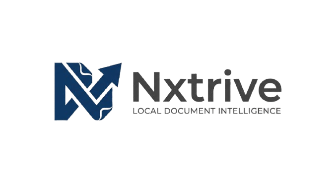

# Nxtrive

**Offline local RAG for your documents — private, open source, and built for Windows, macOS, and Linux.**

[](https://nxtrive.vercel.app/)
[](LICENSE)
[](https://react.dev/)
[](https://www.typescriptlang.org/)
[](https://vite.dev/)

> **Your documents. Your machine. Your answers.**

Official marketing website and landing page for [Nxtrive](https://nxtrive.vercel.app/) — a free, open-source desktop app that lets you chat with PDFs, Word files, and code using a **local LLM**. No cloud uploads. No API keys. No account.

**Maintained by [@devzeromax](https://github.com/devzeromax)**

---

## Table of contents

- [About the product](#about-the-product)
- [About this repository](#about-this-repository)
- [Preview](#preview)
- [Features](#features)
- [Tech stack](#tech-stack)
- [Getting started](#getting-started)
- [Configuration](#configuration)
- [Deployment](#deployment)
- [Project structure](#project-structure)
- [Contributing](#contributing)
- [License](#license)

---

## About the product

Nxtrive is a **local RAG** (retrieval-augmented generation) application. It indexes folders on your machine, retrieves relevant passages, and generates answers with **source citations** — entirely offline after setup.

| | |
| :-- | :-- |
| **Platforms** | Windows 10/11 · macOS 10.15+ · Linux (Ubuntu 22.04+) |
| **LLM runtime** | [Ollama](https://ollama.com/) |
| **File types** | PDF, Word, Markdown, CSV, JSON, HTML, CSS, source code |
| **License** | MIT — free forever, no subscription |

---

## About this repository

This repo powers the **production marketing site** at [nxtrive.vercel.app](https://nxtrive.vercel.app/). It is a single-page React application with:

- Product storytelling, demos, and download CTAs
- SEO-optimized build pipeline (meta tags, JSON-LD, sitemap, crawlable HTML)
- Performance-focused animations with reduced-motion support
- Accessibility-first navigation and layout

---

## Preview

<p align="center">
  <a href="https://nxtrive.vercel.app/">
    
  </a>
</p>

<p align="center">
  <a href="https://nxtrive.vercel.app/"><strong>→ View live site</strong></a>
</p>

---

## Features

### Product (Nxtrive app)

- **100% offline** — index and chat without a network connection
- **Private by design** — documents never leave your device
- **Cited answers** — every response traceable to source files
- **Folder ingestion** — drag-and-drop indexing with multiple collections
- **Cross-platform** — Windows, macOS, and Linux builds

### Website (this repo)

- Responsive landing page with scroll-driven product showcase
- Persona-based use-case sections (research, legal, clinical, developers, and more)
- Platform download section linked to GitHub Releases
- FAQ with `FAQPage` structured data
- Build-time SEO: Open Graph, Twitter Cards, canonical URLs, JSON-LD schemas
- Auto-generated `sitemap.xml`, `robots.txt`, and `llms.txt`
- Security headers via Vercel (CSP, Referrer-Policy, X-Frame-Options)

---

## Tech stack

| Category | Tools |
| :-- | :-- |
| **Frontend** | React 19, TypeScript, Tailwind CSS v4 |
| **Build** | Vite 8, Oxlint |
| **Animation** | Motion, Lenis smooth scroll |
| **Icons** | Lucide React |
| **Hosting** | Vercel |

---

## Getting started

### Prerequisites

- [Node.js](https://nodejs.org/) 20 or later
- npm 10 or later

### Install

```bash
git clone https://github.com/devzeromax/Nxtrive.git
cd Nxtrive
npm install
```

### Development

```bash
npm run dev
```

Local server: **http://localhost:5174**

### Production build

```bash
npm run build
npm run preview
```

| Script | Description |
| :-- | :-- |
| `npm run dev` | Start development server |
| `npm run build` | Type-check and build to `dist/` |
| `npm run preview` | Preview production build locally |
| `npm run lint` | Run Oxlint |

---

## Configuration

Copy the example environment file:

```bash
cp .env.example .env
```

| Variable | Required | Description |
| :-- | :--: | :-- |
| `VITE_SITE_URL` | Yes | Canonical site URL for SEO (no trailing slash). Example: `https://nxtrive.vercel.app` |

SEO copy, FAQ items, and structured data are defined in [`seo.build.ts`](./seo.build.ts).

---

## Deployment

### Vercel (recommended)

1. Push to [github.com/devzeromax/Nxtrive](https://github.com/devzeromax/Nxtrive)
2. Import the repository on [Vercel](https://vercel.com/new)
3. Set environment variable `VITE_SITE_URL` to your production URL
4. Use build command `npm run build` and output directory `dist`

### Search indexing

After deploy:

1. Verify the site in [Google Search Console](https://search.google.com/search-console)
2. Submit sitemap: `sitemap.xml`
3. Request indexing for your homepage URL

---

## Project structure

```text
├── public/                 Static assets, fonts, logos, verification files
├── seo.build.ts            SEO config, JSON-LD, sitemap & robots generators
├── src/
│   ├── components/
│   │   ├── marketing/      Page sections (Hero, Features, FAQ, Navbar, …)
│   │   └── ui/             Shared UI components and animations
│   ├── hooks/              React hooks
│   ├── lib/                Brand, links, utilities
│   └── styles/             Typography and design tokens
├── vercel.json             Deployment headers
├── vite.config.ts          Vite config + SEO build plugin
└── index.html              HTML shell
```

---

## Contributing

Contributions are welcome. For significant changes, open an issue first.

1. [Fork the repository](https://github.com/devzeromax/Nxtrive/fork)
2. Create your branch: `git checkout -b feat/your-feature`
3. Commit your changes: `git commit -m "Add your feature"`
4. Push and open a Pull Request

---

## License

Nxtrive is released under the [MIT License](LICENSE).

---

<p align="center">
  <a href="https://nxtrive.vercel.app/">Website</a> ·
  <a href="https://github.com/devzeromax/Nxtrive/releases">Releases</a> ·
  <a href="https://github.com/devzeromax/Nxtrive/issues">Issues</a> ·
  <a href="https://github.com/devzeromax">@devzeromax</a>
</p>
