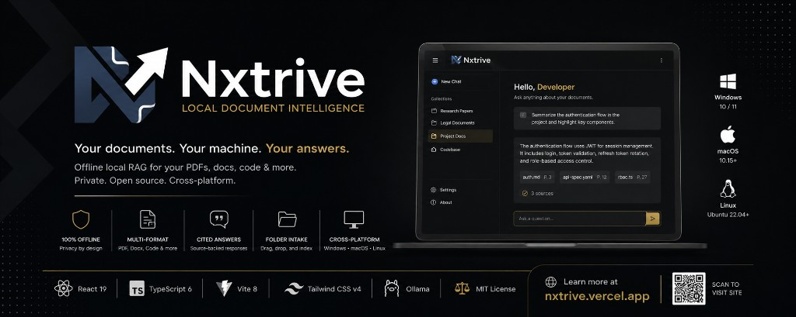

<p align="center">
  <a href="https://nxtrive.vercel.app/">
    
  </a>
</p>

<p align="center">
  <a href="https://nxtrive.vercel.app/"><strong>🌐 nxtrive.vercel.app</strong></a>
  &nbsp;·&nbsp;
  <a href="https://github.com/devzeromax/Nxtrive/releases">Releases</a>
  &nbsp;·&nbsp;
  <a href="https://github.com/devzeromax/Nxtrive/issues">Issues</a>
</p>

<p align="center">
  
  
  
  
  
  
  
</p>

<p align="center">
  <sub>Maintained by <a href="https://github.com/devzeromax">@devzeromax</a></sub>
</p>

---

## Table of contents

- [Overview](#overview)
- [Key features](#key-features)
- [Supported platforms](#supported-platforms)
- [About this repository](#about-this-repository)
- [Tech stack](#tech-stack)
- [Getting started](#getting-started)
- [Configuration](#configuration)
- [Deployment](#deployment)
- [Contributing](#contributing)
- [License](#license)

---

## Overview

**Nxtrive** is a free, open-source **local document intelligence** app for Windows, macOS, and Linux. Chat with PDFs, Word files, code, and more using **offline local RAG** — private, cited, and powered by a local LLM through [Ollama](https://ollama.com/).

> **Your documents. Your machine. Your answers.**

No cloud uploads. No API keys. No account.

---

## Key features

| | Feature | Description |
| :---: | :-- | :-- |
| 🛡️ | **100% offline** | Privacy by design — works without a network after setup |
| 📄 | **Multi-format** | PDF, Word, Markdown, CSV, JSON, HTML, CSS, and source code |
| 💬 | **Cited answers** | Every response traceable to source files and passages |
| 📁 | **Folder intake** | Drag, drop, and index entire collections |
| 🖥️ | **Cross-platform** | Native builds for Windows, macOS, and Linux |

---

## Supported platforms

| Platform | Version |
| :-- | :-- |
| **Windows** | 10 / 11 |
| **macOS** | 10.15+ |
| **Linux** | Ubuntu 22.04+ (or equivalent) |

**Requirements:** 8 GB RAM minimum (16 GB+ recommended) · [Ollama](https://ollama.com/) installed

---

## About this repository

This repo contains the **official marketing website** for Nxtrive — a production React landing page with product demos, download CTAs, and a full SEO build pipeline.

- Scroll-driven product showcase and live chat mockup
- Persona-based use-case sections
- FAQ with `FAQPage` structured data
- Auto-generated `sitemap.xml`, `robots.txt`, and `llms.txt`
- Security headers (CSP, Referrer-Policy, X-Frame-Options)

**Live site:** [nxtrive.vercel.app](https://nxtrive.vercel.app/)

---

## Tech stack

| Category | Tools |
| :-- | :-- |
| **Frontend** | React 19, TypeScript, Tailwind CSS v4 |
| **Build** | Vite 8, Oxlint |
| **Animation** | Motion, Lenis |
| **LLM** | Ollama (local inference) |
| **Hosting** | Vercel |

---

## Getting started

### Prerequisites

- [Node.js](https://nodejs.org/) 20+
- npm 10+

### Install & run

```bash
git clone https://github.com/devzeromax/Nxtrive.git
cd Nxtrive
npm install
npm run dev
```

Local server: **http://localhost:5174**

### Build

```bash
npm run build    # type-check + production build → dist/
npm run preview  # preview locally
npm run lint     # run Oxlint
```

---

## Configuration

```bash
cp .env.example .env
```

| Variable | Description |
| :-- | :-- |
| `VITE_SITE_URL` | Canonical URL for SEO (no trailing slash). Example: `https://nxtrive.vercel.app` |

SEO copy and structured data live in [`seo.build.ts`](./seo.build.ts).

---

## Deployment

1. Push to [github.com/devzeromax/Nxtrive](https://github.com/devzeromax/Nxtrive)
2. [Import on Vercel](https://vercel.com/new) · build: `npm run build` · output: `dist`
3. Set `VITE_SITE_URL` to your production URL
4. Verify in [Google Search Console](https://search.google.com/search-console) and submit `sitemap.xml`

---

## Contributing

1. [Fork the repo](https://github.com/devzeromax/Nxtrive/fork)
2. `git checkout -b feat/your-feature`
3. Commit and open a Pull Request

---

## License

Nxtrive is open source under the [MIT License](LICENSE).

---

<p align="center">
  <a href="https://nxtrive.vercel.app/">Website</a> ·
  <a href="https://github.com/devzeromax/Nxtrive">GitHub</a> ·
  <a href="https://github.com/devzeromax">@devzeromax</a>
</p>

<p align="center">
  <strong>Nxtrive</strong> — Local document intelligence
</p>
